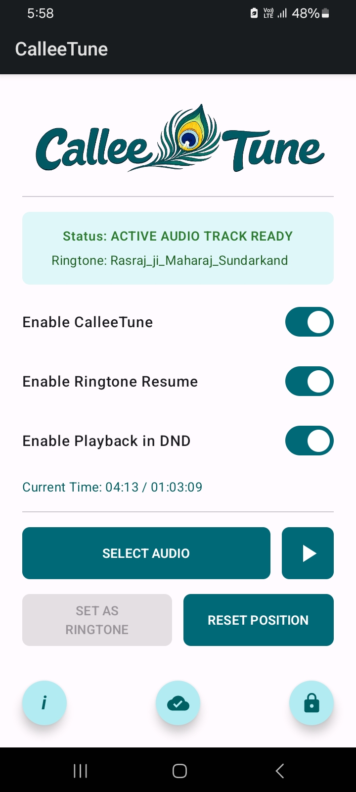
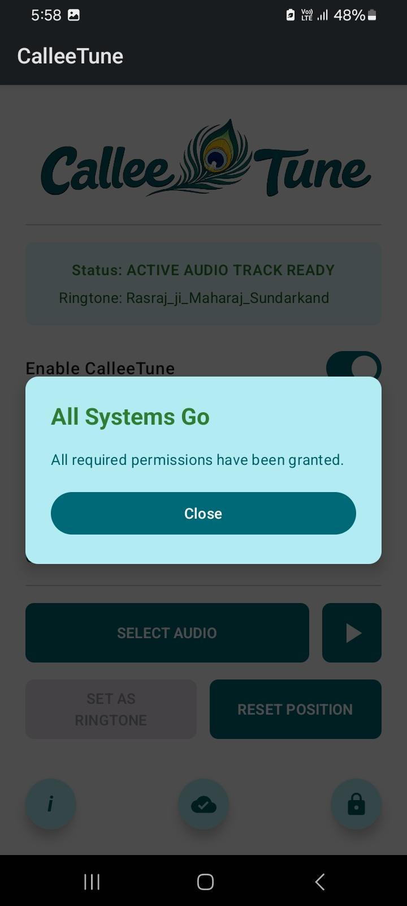
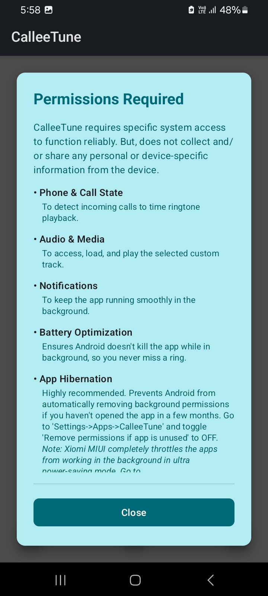
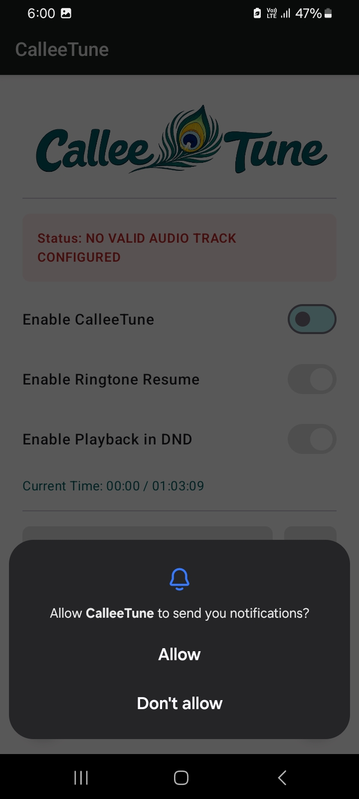
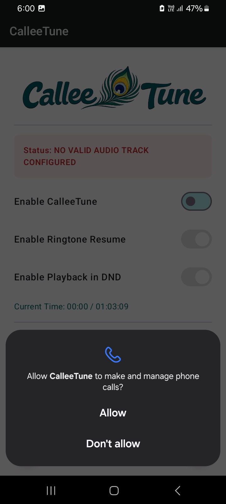
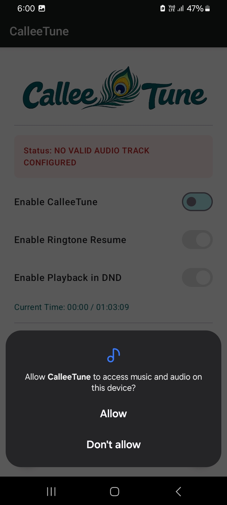
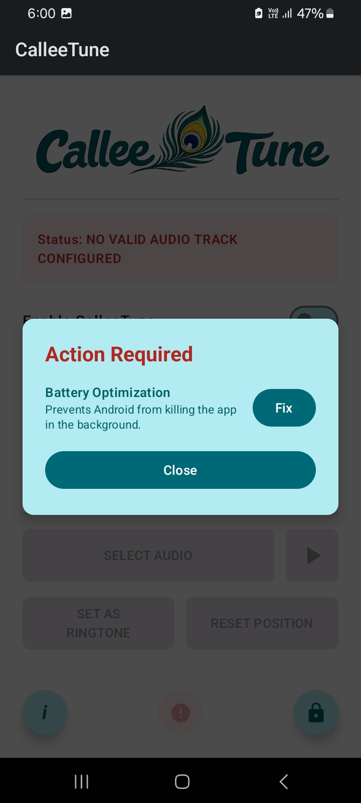
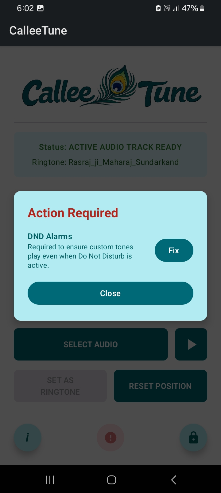

# CalleeTune
Welcome to the official, and only legitimate, source of information for **CalleeTune**, the app.

This document serves as the public face of the app, providing a user guide and a dedicated space for feedback. 

## Table of Contents
1. [Introduction](#introduction)
2. [System Requirements](#system-requirements)
3. [App Demo](#app-demo)
4. [User Interface (UI) Guide](#user-interface-ui-guide)
5. [Permissions Explained](#permissions-explained)
6. [Bug Reports & Feature Requests](#bug-reports--feature-requests)

---

## Introduction

**CalleeTune** is a utility application envisioned and created to enhance your Android device's incoming call experience. 

**The Purpose:** It is lovingly created in response to a single question: _what if my favourite music/song set as a ringtone could continue across calls rather than start from the beginning on every incoming call so that I could hear it the whole?_ That'it. **CalleTune** allows the ringtone playback to resume from the last stopped position across incoming calls, allowing you to hear the whole song, divided in parts, across calls. Additionally, it provides you with an option to set your favourite music/song as a system ringtone from within it. 

**Privacy First:** CalleeTune requires specific system access to serve its purpose reliably, but it **DOES NOT** collect and/or share any of your __personal__ or __device-specific information__ from your device.

---

## System Requirements

* **Operating System:** Tested to work reliably on Android 14 or higher. You can try to use it on lower versions, but, it may not work as expected, and no support would be provided for them. The app has been tested on 3 different OEM skins: Samsung _OneUI_, Xiomi _MIUI_, and Vivo _FunTouch_. 

---

## App Demo

Watch CalleeTune in action to see how easy it is to configure your custom ringtone experience:

<video src="videos/CalleeTune_Setup_Guide.mp4" controls width="100%" playsinline>
  Your browser does not support the video tag.
</video>

---

## User Interface (UI) Guide

CalleeTune is designed with a straightforward interface so you can configure your ringtone in seconds. It works with your existing set ringtone as well without needing to change it. Below is a brief of the every setting from the screen.

### UI Screenshot Gallery

  

    
    
Fully configured app UI.

  

  

    
    
The sign that all the pieces are in place for CalleeTune to function smoothly.

  

  

    
    
The bottom-right button gives a brief about the required permissions. Some are mandatory while the others are optional depending upon the configuration.

  

  

    
    
CalleeTune would be disabled if any of the mandatory permissions are either missing or revoked. This is indicated as a notification during an incoming call to fix. Opening the app would automatically request the missing permission(s). Here, Notification permission is missing. However, this is not mandatory, but, critical to be informed about when the permissions are revoked in the bacground by Android. Once disabled, the app would remain disabled and have to be enabled manually by toggling "Enable CalleeTune"

  

  

    
    
Missing phone call permission.

  

  

    
    
Missing phone and audio permission.

  

  

    
    
The user is notified if any of the critical permissions are missing, and provides the means to fix it. Here, mandatory whilisting from battery-optimisation is revoked. The permissions manager has notified this. See the colour of the button at the bottom-centre of the UI.

  

  

    
    
Here one of the mandatory sub-requirement to work in DND-mode is missing. So, CalleeTune would function as expected outside of DND-mode, but, would remain disabled in DND-mode. The permission manager duly notifies the same.

  

### 1. Enable CalleeTune Toggle
* **Purpose:** The master switch. When enabled, it allows CalleeTune to actively intercept incoming calls and play your favourite music. 

### 2. Track Status Diagnostic Box
* **Purpose:** A dynamic status box that lets you know whether the app is ready. It displays your currently active ringtone, warns if no valid track is configured, or alerts if the app failed to set the ringtone.

### 3. Enable Ringtone Resume Toggle
* **Purpose:** The reason CalleeTune is created in the first place. When toggled ON, CalleeTune remembers exactly where your ringtone stopped playing during your last incoming phone call and will resume from that exact second on your next incoming call. If OFF, the playback starts from the beginning on every call, just like your normal ringtone. _**Recommended**_: Keep this ON. Otherwise, what is the point of having this app? :wink:

### 4. Enable Playback in DND Toggle
* **Purpose:** This setting allows your custom ringtone to bypass system silence, i.e. DND-mode, ensuring your audio plays even when your device is set to "Do Not Disturb" mode, respective the user-set DND settings. This is optional. Keeping this OFF, while keeping the app enabled, would make CalleeTune to work only outside DND-mode. In DND-mode, the app would let native Android handle the ringtone.

### 5. Track Progress Indicator
* **Purpose:** A simple text readout that shows your current resume position alongside the total duration of your loaded audio track. At the end-of the track, the playback starts allover again.

### 6. Select Audio Button
* **Purpose:** Lets you directly select an audio file you want to use as your system ringtone.

### 7. Preview (Play/Pause) Button
* **Purpose:** Audio preview of the selected file.

### 8. Set As Ringtone Button
* **Purpose:** Registers your selected audio track as your official device ringtone. Note that even if you remove the app for some reason (but, kindly provide your feedback here under "Issues" for my knowledge and consideration), the ringtone set via this would continue to remain your system ringtone. 

### 9. Reset Position Button
* **Purpose:** Instantly resets the saved "resume" playback position back to the very beginning (00:00) of the audio.

### 10. Floating Action Buttons (Bottom of the Screen)
* **About ('_i_'):** Basic app info which would be very helpful should you decide to report any issues or features.
* **Permissions Info (Lock Icon):** Details all the system permissions the app requires.
* **Permission Alert (Cloud/Error Icon):** This icon flashes red to alert you if your device is missing any critical system permissions. Tapping it opens a tracker to help you fix the missing access.

---

## Permissions Explained

To make features like call-interception and ringtone-resuming possible, CalleeTune needs special access to certain parts of your Android device. We believe in total transparency. Here is exactly what **CalleeTune** requests and why:

* **Phone & Call State (Mandatory):** Required to detect an incoming call for the app to correctly time the ringtone playback.
* **Audio & Media (Mandatory):** Necessary to access your device's storage to load and play your selected favorite audio files.
* **Notifications:** Needed to ensure that the app functions smoothly and reliably in the background when a call arrives. Not mandatory, but, recommended. The app would notify if any of the critical permissions are revoked in the background, especially in power-saving modes, by OEM skins.
* **Battery Optimisation:** Android often aggressively shuts down background apps to save battery. This permission ensures the system doesn't kill CalleeTune, so you never miss a ring.
* **App Hibernation (Auto Revoke):** Optional, but, highly recommended. Android automatically revokes background permissions from apps you haven't opened in a few months, while CalleeTune mostly works in the background. This prevents it from quietly breaking if you haven't opened the app in a while. 
  * *Note for Xiaomi Users:* MIUI completely throttles apps working in the background in ultra power-saving mode, even when mandatory permissions are granted. You must go to `Settings -> Apps -> Background autostart` and enable the CalleeTune toggle manually while configuring the app. Refer [this guide](https://dontkillmyapp.com/xiaomi) for more details.
* **Do Not Disturb (DND) / DND Alarms:** Only requested if you explicitly enable the "Playback in DND" feature. It allows the app to bypass device silence. If denied, the app simply remains silent during DND mode and let Android handle the ringtone playback.

---

## Bug Reports & Feature Requests

Encountered a bug or have an idea for a new feature? I want to hear about it!

Please use the **[Issues](https://github.com/TheQuietMonk/CalleeTune_TheApp/issues)** tab at the top of this repository to submit a ticket. When submitting a bug report, please include your device model, Android version, and steps to reproduce the issue.

If you want a new feature, I would recommend starting a new discussion under **[Discussions](https://github.com/TheQuietMonk/CalleeTune_TheApp/discussions)** before raising it under issues. Similarly, prefer using **[Q&A](https://github.com/TheQuietMonk/CalleeTune_TheApp/discussions/categories/q-a)** under **[Discussions](https://github.com/TheQuietMonk/CalleeTune_TheApp/discussions)** for a query before directly reporting under **[Issues](https://github.com/TheQuietMonk/CalleeTune_TheApp/issues)** if you are not sure whether it's a bug.
